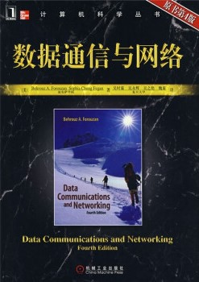
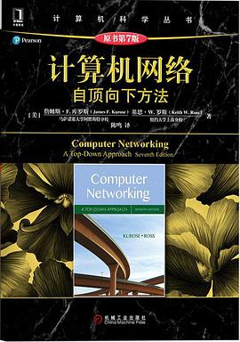
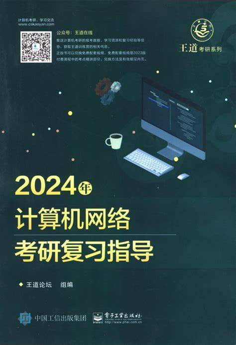
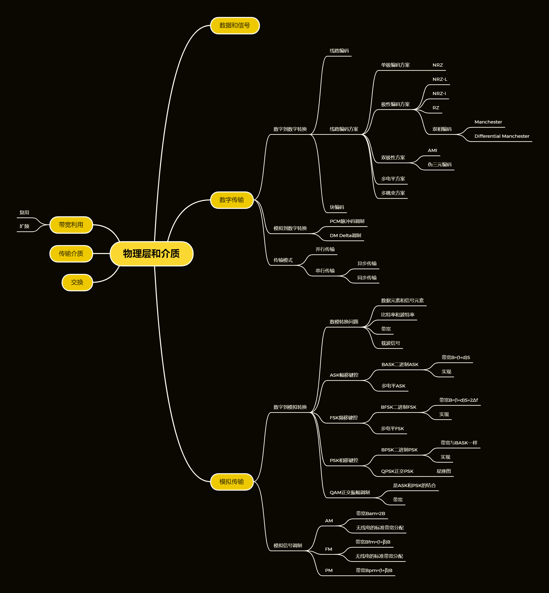
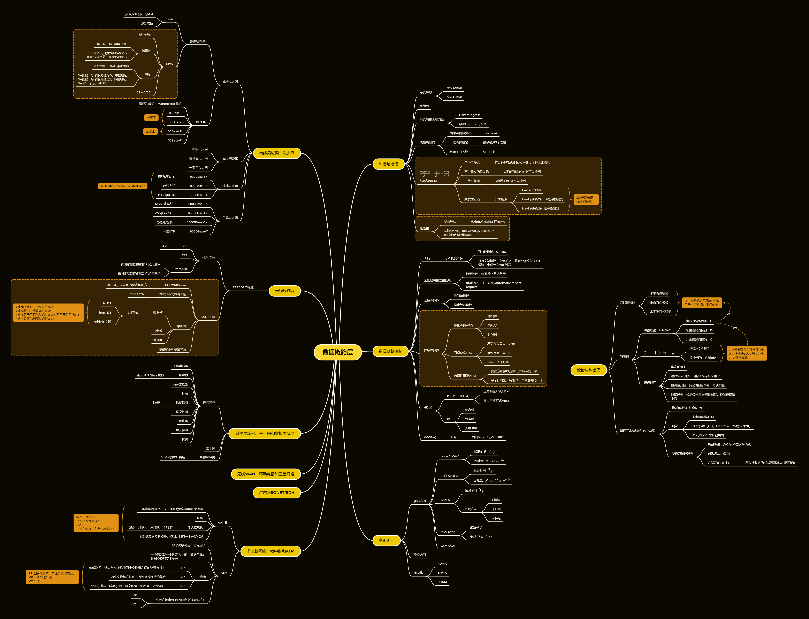
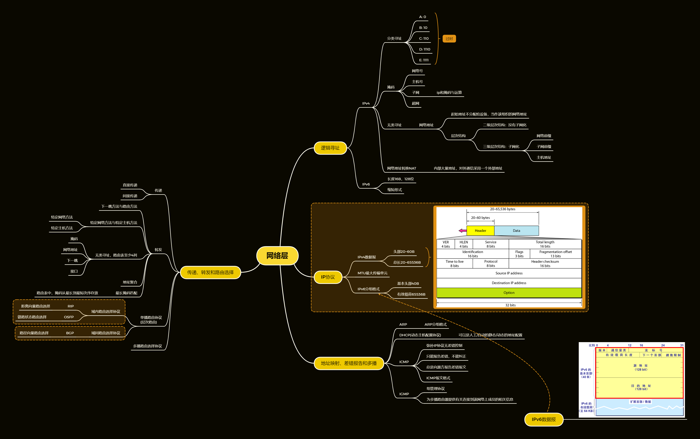
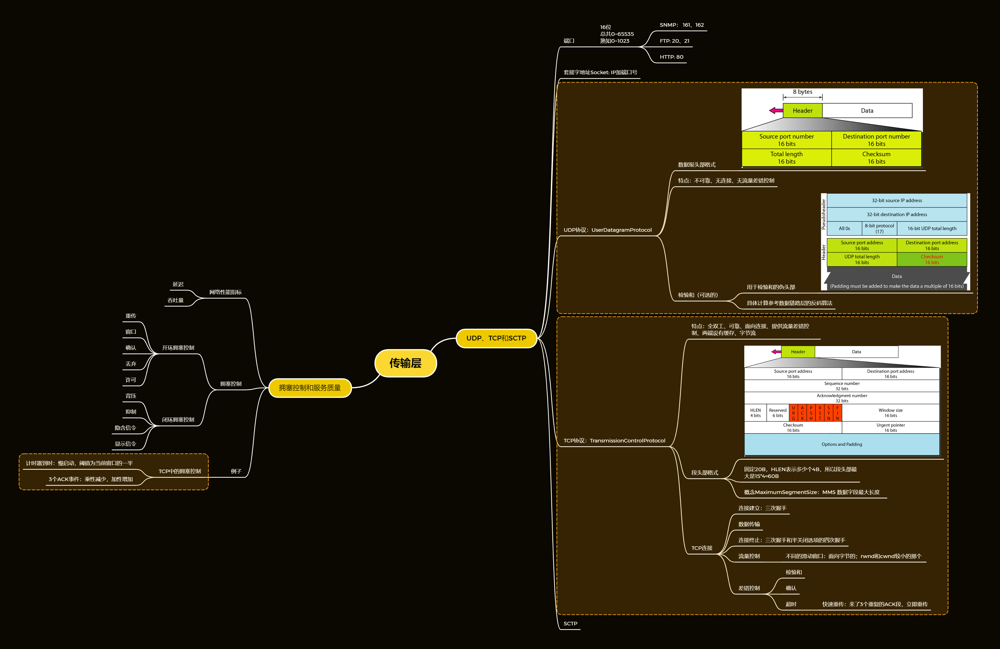
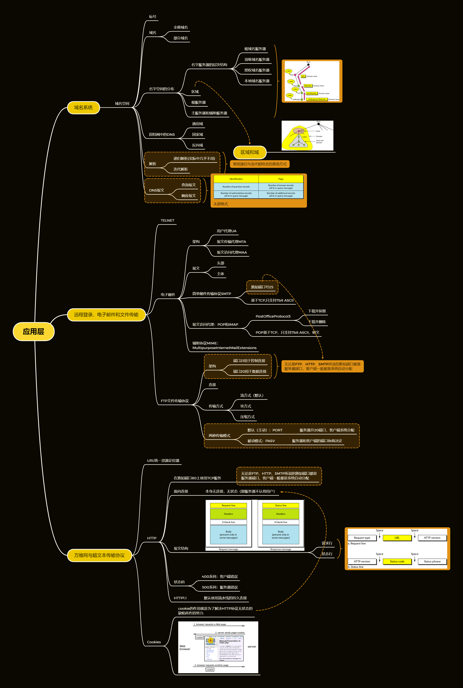

# CS-SurvivalGuide
西电CS学生自救指南，包含计组、计网、OS的学习指南。

- [CS-SurvivalGuide](#cs-survivalguide)
- [计算机组织和体系结构/组成原理](#计算机组织和体系结构组成原理)
  - [参考书籍](#参考书籍)
  - [思维导图](#思维导图)
  - [Labs](#labs)
  - [资料](#资料)
- [计算机网络](#计算机网络)
  - [指南](#指南)
  - [参考书籍](#参考书籍-1)
  - [思维导图](#思维导图-1)
  - [Labs](#labs-1)
  - [资料](#资料-1)
- [操作系统](#操作系统)
  - [参考书籍](#参考书籍-2)
  - [思维导图](#思维导图-2)
  - [Labs](#labs-2)
  - [资料](#资料-2)

# 计算机组织和体系结构/组成原理
学分最多的一集。

内容是真他妈多。

## 参考书籍

## 思维导图

## Labs

## 资料

# 计算机网络
最逆天的一集。

生平第一次见过老师翘课，曾经创下一节课讲十章的神话，甚至可以学到让步状语从句。

典型的上课耽误学习的例子。

## 指南

## 参考书籍
西电用的是大黑书《数据通信与网络》，考27个章节。

听说这个也不错

应试嘛，高校出题一般都是抄题，直接考研就行了。

## 思维导图
按照《数据通信与网络》的27章，我按照TCP/IP的5个层次整理了一下。

## Labs
学校的实验都挺简单的。

没啥好说的。

## 资料
目前收集到的，只有侏罗纪时期的ppt，以及年代久远的考题。

# 操作系统

## 参考书籍

## 思维导图

## Labs
我们是自选用Linux或Windows，这里提供Linux环境下的7个实验。

## 资料
