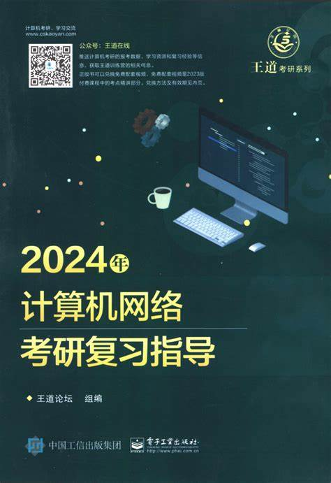

# 计算机通信与网络
- [计算机通信与网络](#计算机通信与网络)
- [前言](#前言)
- [推荐书籍](#推荐书籍)
- [指南](#指南)
- [思维导图](#思维导图)
  - [物理层和介质](#物理层和介质)
  - [数据链路层](#数据链路层)
  - [网络层](#网络层)
  - [传输层](#传输层)
  - [应用层](#应用层)
- [实验](#实验)
- [资料](#资料)

# 前言
最逆天的一集。

生平第一次见到老师翘课，曾经创下一节课讲十章的神话，期中没考试问我们期中考的怎么样，甚至可以学到让步状语从句。（甚至多次登错成绩）

典型的上课耽误学习的例子。

23年6月13补档，期末考只有部分不太确定。趁着记忆，选择题10题（有一题802.11无线局域网定义在哪两层）；大题第一题是香农定理、信噪比相关的计算；第二题是CRC余数的计算；第三题是画Manchester码；第四题第一问考了最小帧长、第二问考了802.3的MAC层帧结构和功能、第三问考了填空（合适位置填入网桥、集线器、交换机、路由器、中继器）；第五题Dijkstra算法生成路由表；第六题IP地址分配；第七题TCP连接建立、数据传输、连接取消的图以及拥塞控制；第八题邮件系统，发送邮件的过程，UA的作用，MTA的作用；收发邮件有哪些协议；

6月23补档，期末考88，实验89.9（奇怪的数字）最后总评88（可以说这是从头到尾自学的一门课了，这样子知足了 3/71）

# 推荐书籍
西电用的是大黑书《数据通信与网络》这本书的特点是非常详细深入，但是也很难。

另外推荐《计算机网络：自顶向下法》

如果你老师很烂，你直接拿本考研书来看就行。

# 指南
西电最后期末考的话，基本上都是偷考研题的。当然还有一些原创的题目（基本都是错题）

所以功利角度来说，想要高分，直接考研。

# 思维导图

## 物理层和介质

## 数据链路层

## 网络层

## 传输层

## 应用层

# 实验
课程实验也是一门玄学（从给分的角度），占比25%就看命吧，实验老师记不住人的。

但是这方面的实验都很简单。

主要内容有

**网络基础知识及双绞线制作、访问网络设备实验**

**交换机VLAN相关实验**

**路由器基础配置实验**

**静态路由和RIP路由配置**

**Windows下DNS、DHCP服务器配置**

**Windows下的WEB、FTP服务器配置**

本人的实验报告已在本库，仅供参考。

# 资料
