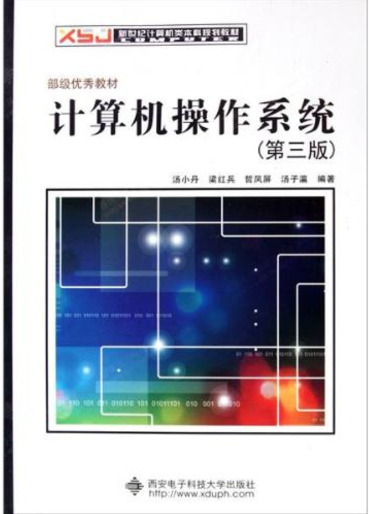
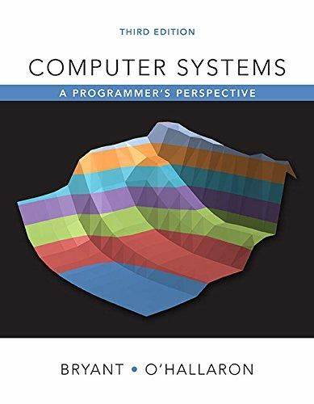
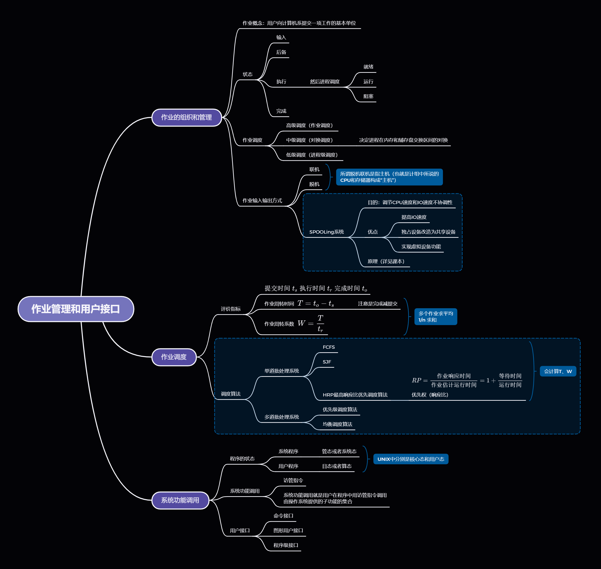
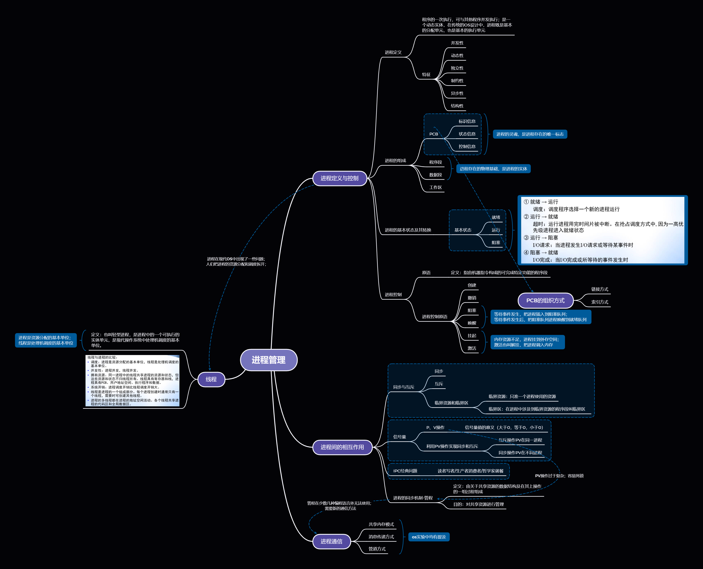
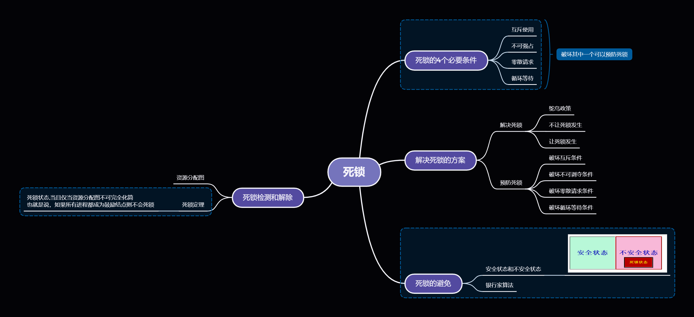
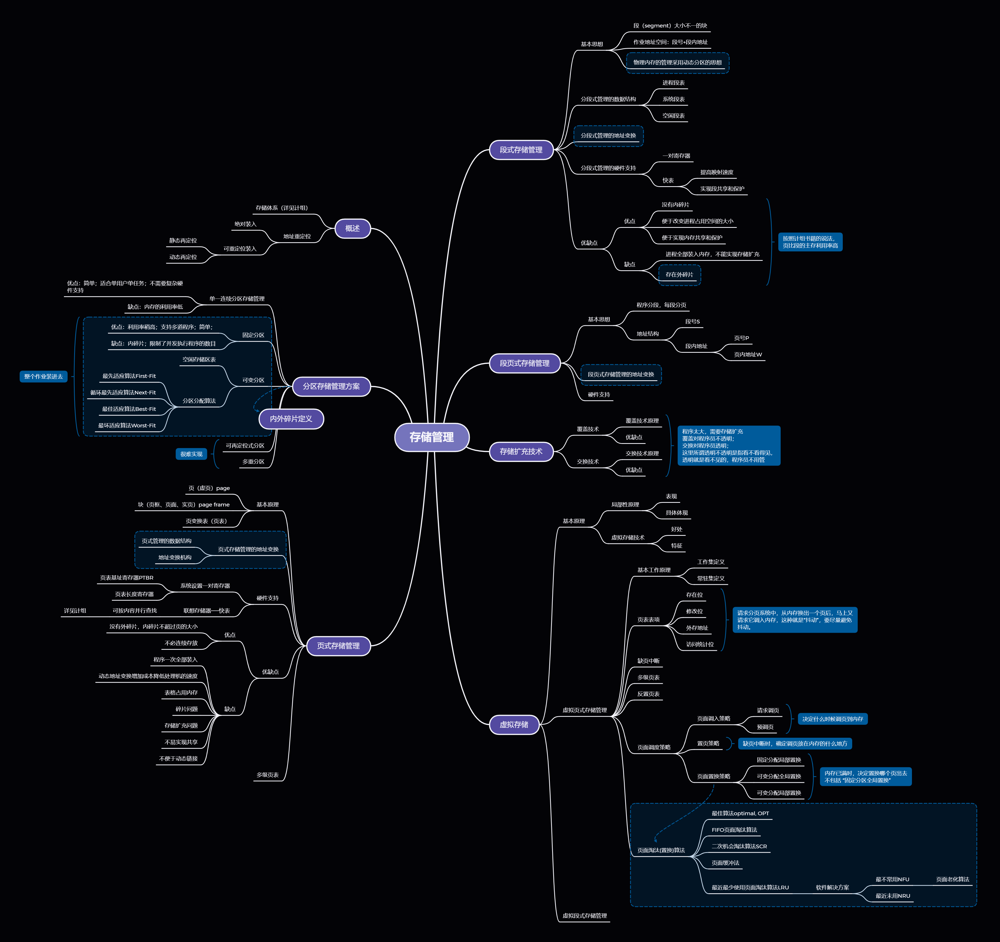
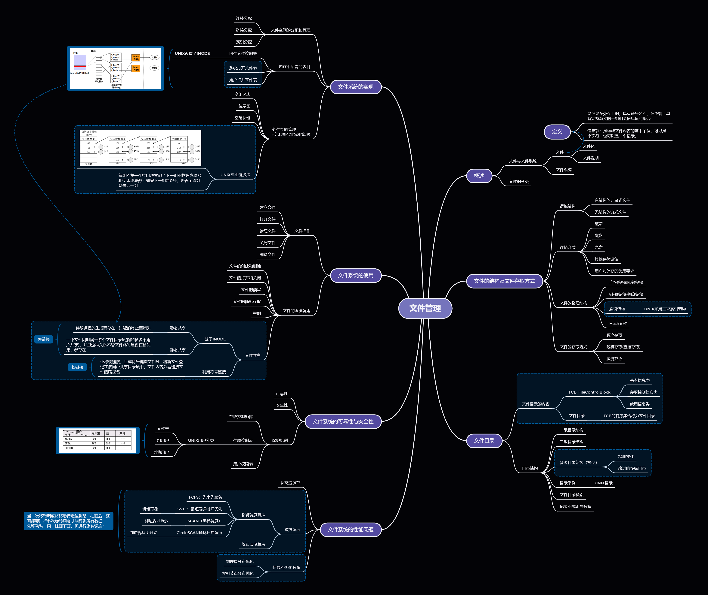
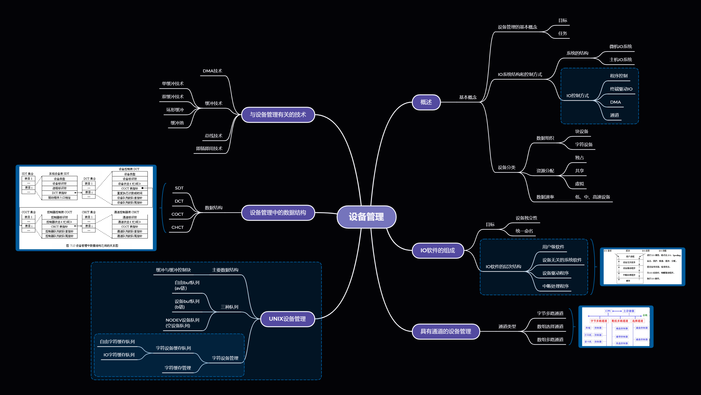

# 操作系统
- [操作系统](#操作系统)
- [前言](#前言)
- [推荐书籍](#推荐书籍)
- [指南](#指南)
- [思维导图](#思维导图)
  - [作业管理和用户接口](#作业管理和用户接口)
  - [进程管理](#进程管理)
  - [死锁](#死锁)
  - [存储管理](#存储管理)
  - [文件管理](#文件管理)
  - [设备管理](#设备管理)
- [实验](#实验)
  - [课内实验](#课内实验)
  - [MIT6.S081/6.828](#mit6s0816828)
- [资料](#资料)

# 前言
    这学期唯一正常的老师。

这门课还好（就考核而言），有点就是八股文，缺点也是如此，这就导致难以深入理解操作系统。

23年6月19补档，期末考刚结束，回忆一下跟往年不同的地方吧，首先选择题有一个FAT簇的分配问题，其他选择没啥特别的；大题的话，第一题是磁盘调度，考了个SCAN算法的，第二题死锁的资源图化简，第三题多级队列循环调度（这个点往年没考过），第四题银行家算法，第五题虚存相关内容、然后是缺页的置换算法LRU FIFO啥的，第六题是UNIX的文件打开的那题（稍微不同的是要求画出磁盘索引区），第七题多道程序的作业调度，计算平均周转时间和周转系数，细心即可。

# 推荐书籍
首先必然是课内要考的书 方敏的《计算机操作系统》（因为要考试）

当然传说中的CSAPP

然后推荐 **MIT的6.S081/6.828**

# 指南
这门课不难，认真学，实验认真做。

# 思维导图
按照各个章节稍微整理了一下：

## 作业管理和用户接口

## 进程管理

## 死锁

## 存储管理

## 文件管理

## 设备管理

# 实验

## 课内实验
实验挺有意思，而且会加深你对OS的理解，认真做。

主要内容：

**进程的建立**

**线程共享进程数据**

**信号通信**

**匿名管道通信**

**使用命名管道通信建立客户服务器关联程序**

**信号量实现进程同步**

**共享主存实现进程通信**

......等，还有很多。

本人的实验报告已在本库，仅供参考。 

## MIT6.S081/6.828

(先挖坑吧)

# 资料
